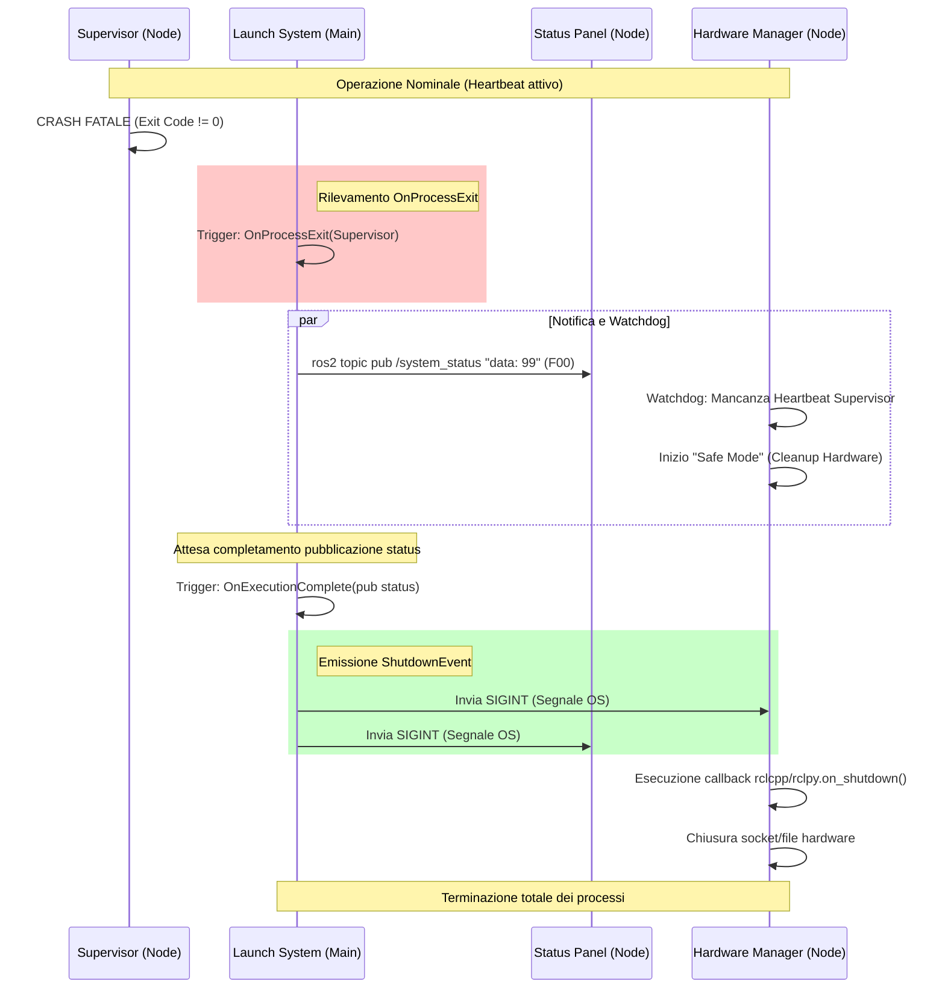

```mermaid
sequenceDiagram
    participant S as Supervisor (Node)
    participant L as Launch System (Main)
    participant P as Status Panel (Node)
    participant H as Hardware Manager (Node)

    Note over S, H: Operazione Nominale (Heartbeat attivo)
    
    S ->> S: CRASH FATALE (Exit Code != 0)
    
    rect rgb(255, 200, 200)
    Note right of L: Rilevamento OnProcessExit
    L ->> L: Trigger: OnProcessExit(Supervisor)
    end

    par Notifica e Watchdog
        L ->> P: ros2 topic pub /system_status "data: 99" (F00)
        H ->> H: Watchdog: Mancanza Heartbeat Supervisor
        H ->> H: Inizio "Safe Mode" (Cleanup Hardware)
    end

    Note over L: Attesa completamento pubblicazione status
    
    L ->> L: Trigger: OnExecutionComplete(pub status)
    
    rect rgb(200, 255, 200)
    Note right of L: Emissione ShutdownEvent
    L ->> H: Invia SIGINT (Segnale OS)
    L ->> P: Invia SIGINT (Segnale OS)
    end

    H ->> H: Esecuzione callback rclcpp/rclpy.on_shutdown()
    H ->> H: Chiusura socket/file hardware
    
    Note over L, H: Terminazione totale dei processi
```