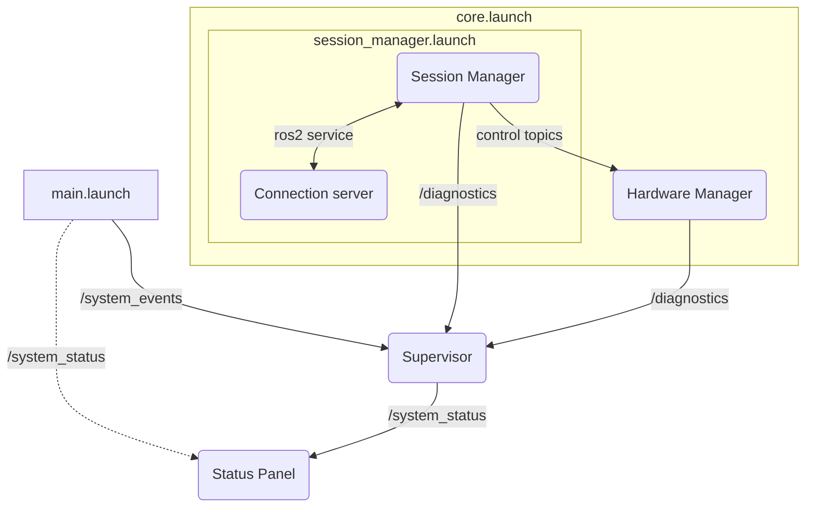

# Launch systme architecture of the Animacharacter Engine system

Struttura (ros2 launch rispecchia questa struttura):

```
main.launch
    |-- core.launch
    |   |-- hardware manager (Node)
    |   |-- session_manager.launch
    |   |   |-- manager (Node)
    |   |   |-- connection server (Node + fastapi)
    |-- monitor.launch
    |   |-- webUI (Node)
    |   |-- status panel (Node)
    |   |-- (other...)
    |-- (other...)
    |-- Supervisor (Node)
```

Il sistema di launch è gerarchico, ogni *.launch è un file di launch indipendente che coordina un sottosistema.
Ogni sottosistema ha delle policy di health management; crash dei processi del **core** arrestano l'intero sistema;
crash dei processi di monitor possono essere riavviati.

Nella mappa dei nodi, si ha:



### Topics
- **/system_events**: pubblicati dal sistema launch tramite comandi one-shot, notifica degli EXIT, START dei vari processi.
- **/diagnostics**: sistema standard in ros2 per la pubblicazione di log diagnostici. Potenzialmente, utilizzabile insieme a un diagnostic_aggregator.
- **/system_status**: in base agli eventi di diagnostica e di sistema ricevuti, imposta lo stato del sistema; lo status panel riflette lo stato corrente visivamente.
**NB**: in caso eccezionale, system status può essere anche pubblicato direttamente da main.launch (crash del supervisor)

Interfaccia custom per /system_events che includa: node_name, event_type (START/EXIT/CRASH), exit_code e is_critical.

### Flowchart tipiche

#### Nominale

- Avvio supervisor
- Attendi e verifica supervisor OK
- avvia core
- avvia monitor
- il /system_status viene aggiornato prevalentemente da errori e warnigs provenienti da /diagnostics
- se c'è un errore importante, il supervisor ordina lo shutdown del core e degli altri sistemi

#### Errore supervisor
- Avvio supervisor
- Supervisor crash! X
- /system_status pubblicato direttamente da launch
- launch halted (gli altri processi non vengono avviati nemmeno)

#### Errore core
- Avvio supervisor
- Supervisor OK
- Avvio core, core crash! X
- /system_events notifica supervisor 
- supervisor pubblica /system_status
- supervisor ordina lo shutdown generale

#### Errore generico
- Avvio supervisor
- Supervisor OK
- Avvio core
- Avvio monitor
- ... running ...
- *ProcessoX* crash! -> /system_events
- /system_events -> supervisor pubblica warning su /system_status
- launch system gestisce respawn in background
- se *ProcessoX* offline da troppo tempo:
    - supervisor pubblica errore su /system_status
    - supervisor ordina lo shutdown generale


## Gestione di shutdown generale

Quando il supervisor ordina uno shutdown, ci suono due strade:
- utilizzare shutdown coordinato (con chiamate a servizi, lifecyle node)
- spegnere brutalmente i processi (event=shutdown)

Per quanto c'è ancora da ragionare su questo, l'approccio migliore potrebbe essere gestire tutti i nodi lifecycle, metterli in *finalized*. Dopodiché, dopo aver atteso, forzare l'arresto di tutti gli altri processi, fino a chiudere l'intero launch.  
In questo modo, garantiamo sia la chiusura pulita dei processi che supportano lifecycle management, sia la chiusura "sporca" dei processi che non la supportano.

il supervisor ha una lista di nodi lifecycle in uno yaml, su cui itera


Watchdog Attivo: Invece di solo eventi passivi, il Supervisor dovrebbe inviare un segnale "I'M ALIVE" al pannello locale. Se il pannello (che ha un suo piccolo timer interno) non riceve nulla per X ms, mostra autonomamente un errore di "Supervisor Timeout". Questa è la vera soluzione meccatronica per i sistemi robotici. "I'M ALIVE" può essere pubblicato direttamente su /system_status come "supervisor online"

