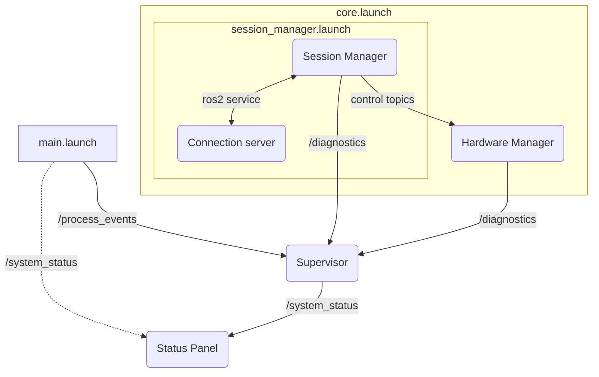

# Launch systme architecture of the Animacharacter Engine system

Struttura (ros2 launch rispecchia questa struttura):

```
main.launch
    |-- core.launch
    |   |-- hardware manager (Node)
    |   |-- session_manager.launch
    |   |   |-- manager (Node)
    |   |   |-- connection server (Node + fastapi)
    |-- monitor.launch
    |   |-- webUI (Node)
    |   |-- status panel (Node)
    |   |-- (other...)
    |-- (other...)
    |-- Supervisor (Node)
```

Il sistema di launch è gerarchico, ogni *.launch è un file di launch indipendente che coordina un sottosistema.
Ogni sottosistema ha delle policy di health management; crash dei processi del **core** arrestano l'intero sistema;
crash dei processi di monitor possono essere riavviati.

Nella mappa dei nodi, si ha:


```mermaid
flowchart TD
    subgraph CORELAUNCH[core.launch]
        subgraph SESSLAUNCH[session_manager.launch]
            A <--> |ros2 service| C(Connection server)
        end
        B
    end

    ML[main.launch] -->|/process_events| SUP
    A(Session Manager) -->|control topics| B
    A -->|/diagnostics| SUP
    B(Hardware Manager) -->|/diagnostics| SUP
    ML[main.launch] -.->|/system_status| M
    SUP(Supervisor) -->|/system_status| M(Status Panel)
```

### Topics
- **/process_events**: pubblicati dal sistema launch tramite comandi one-shot, notifica degli EXIT, START dei vari processi.
- **/diagnostics**: sistema standard in ros2 per la pubblicazione di log diagnostici. Potenzialmente, utilizzabile insieme a un diagnostic_aggregator.
- **/system_status**: in base agli eventi di diagnostica e di sistema ricevuti, imposta lo stato del sistema; lo status panel riflette lo stato corrente visivamente.
**NB**: in caso eccezionale, system status può essere anche pubblicato direttamente da main.launch (crash del supervisor)

Interfaccia custom per /process_events che includa: node_name, event_type (START/EXIT/CRASH), exit_code e is_critical.

### Flowchart tipiche

#### Nominale

- Avvio supervisor
- Attendi e verifica supervisor OK
- avvia core
- avvia monitor
- il /system_status viene aggiornato prevalentemente da errori e warnigs provenienti da /diagnostics
- se c'è un errore importante, il supervisor ordina lo shutdown del core e degli altri sistemi

#### Errore supervisor
- Avvio supervisor
- Supervisor crash! X
- /system_status pubblicato direttamente da launch
- launch halted (gli altri processi non vengono avviati nemmeno)

#### Errore core
- Avvio supervisor
- Supervisor OK
- Avvio core, core crash! X
- /process_events notifica supervisor 
- supervisor pubblica /system_status
- supervisor ordina lo shutdown generale

#### Errore generico
- Avvio supervisor
- Supervisor OK
- Avvio core
- Avvio monitor
- ... running ...
- *ProcessoX* crash! -> /process_events
- /process_events -> supervisor pubblica warning su /system_status
- launch system gestisce respawn in background
- se *ProcessoX* offline da troppo tempo:
    - supervisor pubblica errore su /system_status
    - supervisor ordina lo shutdown generale


### catena di eventi

tutti i processi potrebbero essere avviati simulaneamente, ma questo potrebbe causare race conditions per la pubblicazione dei topic (un crash immediato potrebbe non arrivare al supervisor). Per questa ragione, l'ordine potrebbe essere:
- supervisor spawn
- wait
- spawn tutti gli altri nodi

2 vantaggi:
- se il supervisor crasha subito, nessun altro nodo è stato ancora avviato
- non ci sono race conditions (il supervisor è pronto a ricevere topic).

## Gestione di shutdown generale

Quando il supervisor ordina uno shutdown vengono eseguite due azioni:
- shutdown applicativo coordinato (con chiamate a servizi, lifecyle node shutdown())
- supervisor exit(0), chiusura del processo senza errori
- chiusura dei processi (event=shutdown), gestita dal launch

prima vengono gestiti tutti i nodi lifecycle, mettendoli in *finalized*. Dopodiché, dopo aver atteso un po, forzare l'arresto di tutti gli altri processi, fino a chiudere l'intero launch. Il launch system è configurato per emettere uno Shutdown dopo che il processo supervisor si chiuda; la chiusura controllata del supervisor è usata come trigger per lo shutdown. 
In questo modo, garantiamo sia la chiusura pulita dei processi che supportano lifecycle management, sia la chiusura "sporca" dei processi che non la supportano.

## Watchdogs 

Invece di solo eventi passivi, il Supervisor dovrebbe inviare un segnale "I'M ALIVE" al pannello locale. Se il pannello (che ha un suo piccolo timer interno) non riceve nulla per X ms, mostra autonomamente un errore di "Supervisor Timeout". Questa è la vera soluzione meccatronica per i sistemi robotici. "I'M ALIVE" può essere pubblicato direttamente su /system_status come "supervisor online"

In generale, per nodi critici, invece di monitorare solo /process_events per un eventuale CRASH o chiusura, si dovrebbe monitorare anche un **harthbeat**, per validare l'effettiva funzionalità applicativa del processo.

