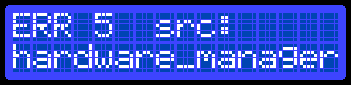
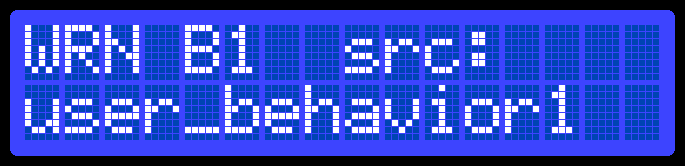
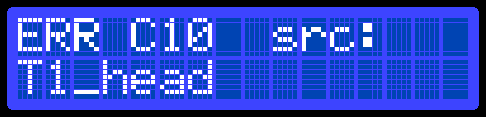
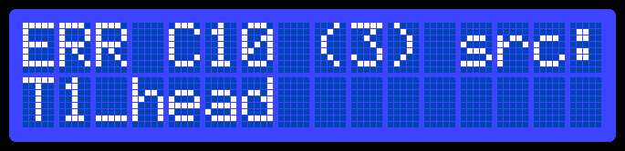

# Hardware layout

Il pannello di stato e controllo principale è una piccola unità hardware, direttamente connessa al raspberri pi, che funge da strumento di interfaccia rudimentale e segnalazione sonoro e visivo per eventi interni all'animacharacter. Può loggare warning, info, crash totali. 

E' composto da:
- un LCD display
- un LED
- un encoder rotativo (manopola)
- un buzzer

### LCD 

Tutti i log appaiono sul pannello in questo formato:
` timestamp [WRN/INF/ERR code]: message`   
esempi:   
`12:30.5 [ERR 01]: Hardware manager crashed at boot`    
`70:13.2 [WRN b50]: Could not connect to head controller`    
`00:05.1 [ERR 00]: Missed hearthbeat from supervisor`   

I messaggi sono scrollabili con manopola, se il messaggio non entra in schermo, viene fatto scorrere quando evidenziato.
    +: cliccare sul messaggio fa vedere info aggiuntive

Tenere premuto il pulsante per piu di 5 secondi apre il meno di amministratore. Da qui sono disponibili
poche azioni, principalmente riavviare il sistema in caso di crash >> REBOOT SYSTEM

L'LCD si spegne se la manopola non è toccata per piu di un tot tempo.

### LED

Il led è un segnalatore di stato molto rudimentale. Codifica per vari stati
- SPENTO: sistema offline o crashato
- LAMPEGGIO LENTO: sistema online in attesa di connessione
- LAMPEGGIO VELOCE: connettendo...
- FISSO: sistema connesso e operativo
- LAMPEGGIO MEDIO: sistema acceso con errori da visualizzare (su LCD)

### buzzer

Il buzzer notifica l'utente dell'avvenimento di warning o errori. In generale, per un errore,
basta un buzz di 1-2 secondi. In alternativa, un buz periodico ogni 10s di 1-2 secondi fino a quando
l'errore non viene visualizzato da LCD, per una durata massima di 1-2minuti.

In caso di crash, il buzzer dovrebbe suonare tipo 4s on 4s off, fino a quando l'utente non riavvia o spegne il sistema.

### Altre considerazioni

Il riavvio eseguito sul pannello è un riavvio SW, significa che viene rilanciata l'immagine docker ma il pi rimane acceso.   

Per un riavvio HW (hard-reset), si possono avere switch ausiliari, anche sullo stesso pannello fisico, ma concettualmente sono cose diverse (cosi come gli switch per l'alimentazione o il current meter e volt meter).

## brainstorming

/process_events
/system_alerts
	timestamp: int
	level: int
	source: str #hellothere
	domain_id: str # domain of source (sys for all non-plugin error codes)
	code: int
	brief: str
	description: str

15:21 [ERR] Serial device disconnected.

> vista base per errori di sistema (codici non in conflitto)
T+13:13.41  (+3)
     ERR 5

https://avtanski.net/projects/lcd/
WRN 12 (3)
HW-MNG

> VALIDA SCELTA  
> per errori con dominio di sistema (no overalp fra codici)  
> oppure senza neanche src:  

   
^^^ corrisponde a --> alert(source=hardware_manager, domain=sys, code=5, level=ERR)

  
^^^ corrisponde a --> alert(source=user_behavior1, domain=behavior, code=1, level=WRN)

   
^^^ corrisponde a --> alert(source=T1_head, domain=hw_controllre, code=10, level=ERR)   
                                   ^^^ nome controller

lo status panel tiene una mappatura fra domain -> char prefix, es:  
sys, core? -> nessun prefisso  
hw_controller -> "C"  
behaviour -> "B"  
se non matcha, usa un prefisso "Unk"  

errori senza prefisso (sys) non dovrebbero possono sovrapporsi  
errori dei controller/behaviour (plugin) possono sovrapporsi  
ma src identifica univocamente la sorgente.  

WRN 10 src:
session_manager

# errori di domini user/plugin (overlap fra codici)
ERR C5 src: <-- 'C' per controller
head_controller <-- nome del controller

ERR B1 <-- 'B' per behavior

o forse meglio, leviamo la brief e suiamo il 'source'
15:21 [ERR 5] HWCTRL-H1
16:00 [WRN 1] SESSION-MNG
16:12 [ERR 9] SESSION-MNG
17:59 [ERR 5] HW-MNG

>sistema di sovrascrizione: se arrivano due alert uguali entro un 
> certo intervallo di tempo, viene sovrascritto il precedente (si 
> può segnalare con un (m))

  
^^^ (3) numero di errori uguali in coda

click --> more info
15:21.13123 [ERR 5] HW-MNG
Serial device 'head-serdev' was probably unplugged
from the usb port. Controller failing to initialize.
# descrizione se presente, altrimenti brief

/system_status
	code: int
	note: str

intf.push_alert(level, code, brief, description, source_override="mybehavior")

3:32 [ERR 2] Hardware is on fire.
3:34 [ERR S1] 'core:hardware_manager' exit: 5.

# altri messaggi

Un meno di accesso e configurazione dovrebbe essere disponibile attraverso LCD. Fa vedere:
- ip rete
- credenziali ssh
- opzione per fare un reboot software
... possibili altre opzioni

navigabile tramite knob