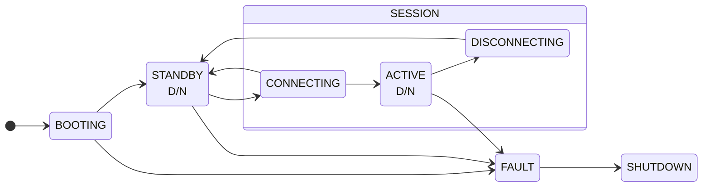

# Stato del sistema

Il funzionamento del sistema complessivo può essere descritto da una FSM:



- **BOOTING**: il sistema è in fase di avviamento, i processi stanno venendo lanciati da launch.
- **STANDBY**: il sistema è operativo e in ascolto di sessioni. L'hardware è disarmato.
- **CONNECTING**: stato transitorio fra la richiesta di connessione e lo stabilimento di una connessione. Una connessione rifiutata o fallita riporta in STANDBY.
- **ACTIVE**: sessione attiva con un client. Hardware armato e operativo.
- **DISCONNECTING**: fase finale di una sessione.
- **FAULT**: stato fatale pre-spegnimento (Alert fatale o crash di un processo critico).
- **SHUTDOWN**: sistema spento e inattivo.
- **D/N**: Degradato / Nominale: se ci sono o meno alert con livello >= WRN presenti in quel momento.

## Gestione FSM

la FSM è gestita dal SupervisorNode, e le transizioni fra stati sono innescate principalmente da eventi Alert (come descritto in [system_alerts](/docs/system_alerts.md#integrazione-con-launch)).

Da notare: il sistema non è implementato in generale con una enorme FSM. Tuttavia, il suo comportamento e il calcolo dello "stato" attuale può essere ben rappresentato da una.

## /system_status

La FSM è la logica utilizzata per stabilire lo stato del sistema momento per momento. /system_status è il topic su cui il supervisor pubblica, ogni volta che cambia, lo stato attuale del sistema. L'anatomia di un messaggio è:
```
SystemStatus.msg
    state_id: (string) identificatore dello stato attuale
    is_degraded: (bool) Flag che indica la presenza di WARN o ERR non fatali.
    legal: (bool) Flag che indica se è avvenuta una transizione prevista dalla FSM (legale) o no (illegale). Se False, c'è probabilmente un bug.
    timestamp: (int) timestamp globale dell'avvenimento
    fault_ref: (Alert Object). Se lo stato è FAULT, contiene un riferimento (*copia*) dell'alert che ha scatenato il blocco fatale.
```


### Integrazione con status panel

Se l'LCD è utilizzato per mostrare Alert, i LED possono essere utilizzati per visualizzare lo stato. 2 LED:
1. Led CONNESSIONE (verde):
    - lampeggia lento -> STDBY
    - lampeggia rapido -> CONNECTING
    - fisso -> ACTIVE
    - spento -> DISCONNECTING

2. Led degradazione (rosso):
    - spento -> NOMINALE
    - lampeggia -> con Alert <= WRN
    - fisso -> con Alert <= ERR

FAULT State:
    - Led 1 SPENTO
    - Led 2 LAMPEGGIA RAPIDO

SHUTDOWN State:
    - Led 1 SPENTO
    - Led 2 SENTO (se shutdown graceful), ACCESO se shutdown da FAULT.
