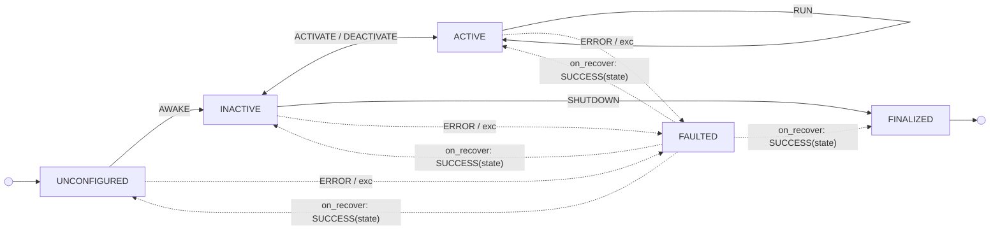

```mermaid
flowchart LR
    START(( )) --> UNCONFIGURED
    UNCONFIGURED -->|AWAKE| INACTIVE
    INACTIVE <-->|"ACTIVATE / DEACTIVATE"| ACTIVE
    ACTIVE -->|RUN| ACTIVE
    INACTIVE -->|SHUTDOWN| FINALIZED
    FINALIZED --> END(( ))

    UNCONFIGURED -.->|"ERROR / exc"| FAULTED
    INACTIVE -.->|"ERROR / exc"| FAULTED
    ACTIVE -.->|"ERROR / exc"| FAULTED

    FAULTED -.->|"on_recover: SUCCESS(state)"| UNCONFIGURED
    FAULTED -.->|"on_recover: SUCCESS(state)"| INACTIVE
    FAULTED -.->|"on_recover: SUCCESS(state)"| ACTIVE
    FAULTED -.->|"on_recover: SUCCESS(state)"| FINALIZED
```